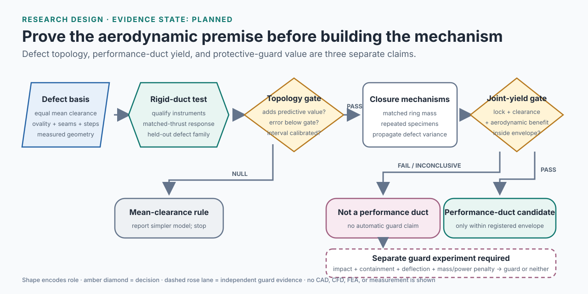

# Segmented Shroud Yield

CAD development is now broken into [individual work orders](docs/CAD_PLAN.md) and a [CAD task ledger](docs/CAD_TASKS.csv). These are planned models, fixtures and release drawings—not completed CAD or hardware evidence.

**Test whether deployment-generated seams, steps, and ovality let a folding rotor shroud retain both safe clearance and aerodynamic value.**

[](https://github.com/500ft/Segmented-Shroud-Yield/actions/workflows/ci.yml)


[](LICENSE)

**[Research question](#research-question) · [First experiment](#first-experiment) · [Evidence boundary](#evidence-boundary) · [Dependency audit](docs/research-dependency-audit.md) · [Roadmap](ROADMAP.md)**



*Conceptual decision diagram—not a prototype or result. Condition: proposed rigid-defect and mechanism study. Evidence state: **planned**. No shroud specimen, aerodynamic measurement, or rubbing test has been completed for this repository.*

## Overview

A folding shroud must reconstruct a useful rotor duct repeatedly, not merely lock into a ring-like shape. Joint error, seam opening, latch preload, and ring distortion can change the circumferential tip-clearance field, which may remove aerodynamic benefit or allow blade contact. This project asks whether deployment-specific defect geometry predicts those outcomes better than average clearance alone.

| | |
| --- | --- |
| **Unit of analysis** | Shroud specimen + closure mechanism + deployment cycle + rotor operating point |
| **Primary defects** | Uniform gap, ovality harmonics, seams, radial steps, and correlated joint error |
| **Primary outputs** | Dynamic minimum clearance, rubbing event, thrust-per-power, deployment and lock success |
| **Minimum experiment** | Adjustable rigid defect duct on a contained rotor stand |
| **Current evidence** | Literature and protocol design only |
| **Physical testing** | Not started; requires qualified metrology and a guarded rotor stand |

**Novelty status:** unresolved. The existing literature map defines a candidate gap, but [`SSY-01`](docs/TASKS.md#ssy-01--close-the-exact-gap-and-measurement-method-search) must close the systematic literature and patent search before any novelty claim is strengthened.

## Research question

> At equal average clearance, do segmented-shroud defect topology and closure variation explain aerodynamic performance and rubbing risk better than a mean-clearance-only model?

The working hypothesis can fail cleanly. If seams and ovality add no predictive value beyond average clearance inside the tested envelope, a simpler tolerance rule should replace the full segmented-defect model.

## How the study works

1. Qualify the clearance and thrust/power measurement systems.
2. Use an adjustable rigid duct to isolate uniform clearance, ovality, seams, and local steps.
3. Compare conditions at matched thrust and record both electrical power and geometry.
4. Fit a defect-aware model and compare it with a mean-clearance baseline on a held-out defect family.
5. Only then compare ordinary and self-centering closure mechanisms at equal ring mass and nominal geometry.
6. Estimate aero-mechanical yield from deployment, lock, clearance, and performance requirements.

The proposed component-level quantity is:

\[
Y_{AM}=P(\text{deployed and locked}\;\land\;c_{min}>c_{safe}\;\land\;\Delta(T/P)>0).
\]

Mass, packed volume, impact protection, and deployment time remain separate system-level outcomes so the yield metric stays interpretable.

## First experiment

The first experiment is a rigid, adjustable defect study—not a spinning deployable ring.

| Field | Registered pilot intent |
| --- | --- |
| **Hypothesis** | At equal mean clearance, a two-lobe distortion or discrete seam causes a repeatable thrust-per-power or minimum-clearance difference beyond measurement uncertainty. |
| **Setup** | One contained rotor stand; open rotor; monolithic reference duct; adjustable rigid duct; uniform, two-lobe, and seam conditions. |
| **Measured** | Geometry, dynamic minimum clearance, thrust, RPM, voltage, current, temperature, vibration, and rubbing events. |
| **Held constant** | Rotor, motor, controller, inlet condition, nominal duct geometry, test order policy, and matched-thrust operating points. |
| **Continue gate** | A defect-aware model improves held-out prediction error by at least 20% relative to the mean-clearance model and reaches below 10% error. |
| **Stop/pivot gate** | The added defect descriptors do not outperform measurement uncertainty or the mean-clearance baseline; report the simpler tolerance result and stop mechanism integration. |

See the complete [`Experiment 01 protocol`](docs/experiment-01-rigid-defect-duct.md). These gates are provisional engineering decisions, not achieved results.

## Evidence boundary

### Present now

- A scoped research question separating established duct and mechanism work from the candidate gap
- Falsifiable hypotheses, causal variables, baselines, and stop conditions
- A specimen-manifest contract for future experiments
- A measurement-first development sequence
- An automated documentation-integrity check

### Not present

- No fabricated duct or deployable shroud
- No CAD, FEA, CFD, bench, rubbing, impact, or flight result
- No demonstrated aerodynamic benefit
- No estimated aero-mechanical yield
- No evidence that a self-centering closure outperforms an ordinary latch
- No authorization for rotor testing

## Check the repository contract

The current executable work checks documentation integrity and protocol structure; it does **not** analyze a rotor.

```bash
python -m pip install -r requirements.txt
python scripts/check_repo_contract.py
python -m unittest discover -s tests -v
```

## Status and next gate

The research-design package and integrity checks exist; CAD, specimens, and every computational or measured result remain pending. The next gate is the exact-gap and measurement-method search in [`SSY-01`](docs/TASKS.md#ssy-01--close-the-exact-gap-and-measurement-method-search), followed by a frozen uncertainty budget and defect basis. The [directed dependency audit](docs/research-dependency-audit.md) shows why the closure mechanism and protective-guard branches require separate positive evidence.

## Documentation

| Document | Purpose |
| --- | --- |
| [`docs/research-plan.md`](docs/research-plan.md) | Research questions, yield definition, hypotheses, variables, and analysis plan |
| [`docs/prior-art.md`](docs/prior-art.md) | Established work and the narrow candidate contribution |
| [`docs/experiment-01-rigid-defect-duct.md`](docs/experiment-01-rigid-defect-duct.md) | Smallest decisive physical experiment |
| [`docs/claim-ledger.md`](docs/claim-ledger.md) | Permitted language for each evidence state |
| [`docs/data-and-figures.md`](docs/data-and-figures.md) | Planned data lineage and visual-evidence rules |
| [`docs/decision-log.md`](docs/decision-log.md) | Decisions, alternatives, and pivot logic |
| [`docs/research-dependency-audit.md`](docs/research-dependency-audit.md) | Source-reviewed directed claim and gate map, including graph limitations |
| [`docs/TASKS.md`](docs/TASKS.md) | Tiered execution plan with simpler-model, duct, guard, and parked branches |
| [`ROADMAP.md`](ROADMAP.md) | Gate-driven path from metrology to possible mechanism validation |

## Repository map

```text
assets/      conceptual diagrams; never presented as hardware evidence
data/        schema and future data-location guidance; currently no observations
docs/        research plan, literature boundary, protocol, and claim controls
protocols/   machine-readable specimen manifest and example
results/     explicit placeholder; currently no results
scripts/     repository-integrity checks
tests/       tests for documentation and protocol contracts
```

## Safety boundary

This repository does not authorize rotor testing. Any experiment requires a structurally rated enclosure, remote arming and shutdown, current protection, verified rotor/duct clearance, eye and hearing protection, debris containment, and approval from the responsible laboratory. Measurement-system qualification and low-energy commissioning precede performance testing.

## Contributing and license

See [`CONTRIBUTING.md`](CONTRIBUTING.md). Source and repository tooling are available under the [MIT License](LICENSE). Third-party papers and documentation remain under their original licenses.
