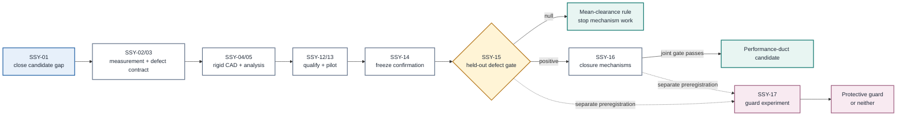

# Research Dependency Audit

> **Evidence state: source-reviewed research design.** This map describes why proposed tasks are
> ordered as they are. It is not a study result and does not establish novelty, aerodynamic
> benefit, strike safety, or guard performance.

## Audit contract

| Field | Value |
| --- | --- |
| Source baseline | [`84b38ff`](https://github.com/500ft/Segmented-Shroud-Yield/commit/84b38ff) |
| Included | [`research-plan.md`](research-plan.md), [`prior-art.md`](prior-art.md), [`experiment-01-rigid-defect-duct.md`](experiment-01-rigid-defect-duct.md), [`claim-ledger.md`](claim-ledger.md), [`decision-log.md`](decision-log.md), and [`ROADMAP.md`](../ROADMAP.md) |
| Excluded | README navigation, CONTRIBUTING, CI, tests, JSON schemas, visual assets, generated task text, and raw centrality rankings |
| Published graph | Directed; every edge was checked against the included source documents |
| Machine-readable form | [`research-dependency-graph.json`](research-dependency-graph.json) |
| Graphify token usage | **Unavailable**. The host did not expose usage, so it is not recorded as zero. |

Graphify was used to surface candidate relationships. The initial repository-wide navigation
graph was undirected and mixed research documents with CI and schema structure, so its hub
rankings are not treated as scientific or causal findings. Its 59 dangling AST edges came from
JSON-Schema `required` references whose generated `ref_*` targets had no nodes; the semantic
document extraction had no dangling endpoints. The reviewed graph below excludes that AST layer.

In this terminology, a **missing endpoint** is a blank source or target field. A **dangling
endpoint** is a nonblank ID for which no node exists. The committed graph is checked for both.

## Directed dependency map

The critical negative-result structure is explicit: failure of the performance-duct path does
not support a protective-guard claim. It can only motivate a separately preregistered experiment
covering impact, containment, deflection, mass, and aerodynamic penalty. That experiment may
still conclude **neither**.

## What this audit does not establish

- Novelty remains unresolved until [`SSY-01`](TASKS.md#ssy-01--close-the-exact-gap-and-measurement-method-search) completes a dated literature and patent search.
- An edge records a documented prerequisite; it does not prove that the proposed method will work.
- No node represents CAD, FEA, CFD, fabrication, or measurement evidence because none exists yet.
- Repository centrality is not used to rank scientific importance.
